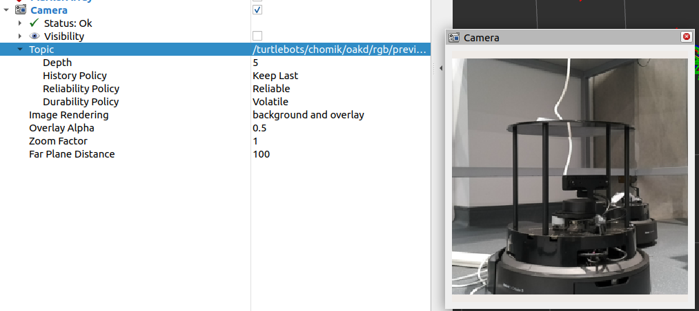
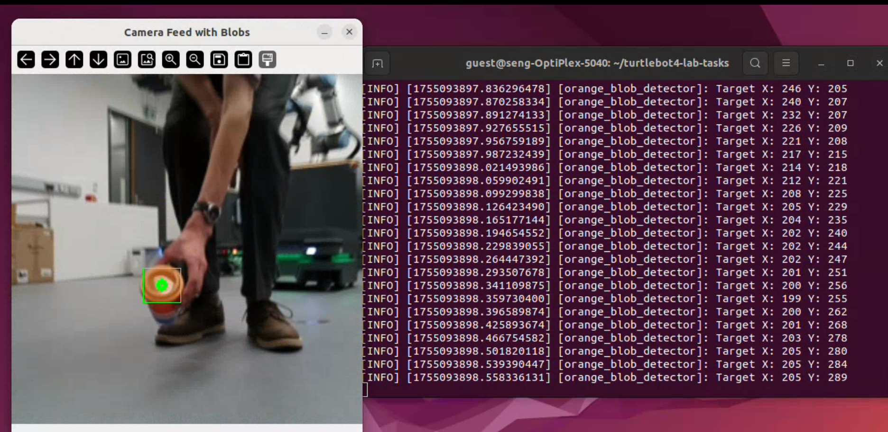

# turtlebot4-lab-tasks
Documentation of tasks constructed with turtlebot4 robots. For basic information and instructions on installing ROS and Turtlebot4 packages refer to [Turtlebot4 User Manual](https://turtlebot.github.io/turtlebot4-user-manual/). You might find solutions of some problems not covered here on [Turtlebot github page](https://github.com/turtlebot/turtlebot4/issues).

**Table of contents:** <br>
- [ ] [**SETTING UP**](#setting-up) <br>
- [ ] [Robot parameters](#robot-parameters) <br>
- [ ] [Common issues (FAQ)](#common-issues-faq)<br>
- [ ] [Reinstalling OS](#reinstalling-os)<br>
- [ ] [Time synchronization](#time-synchronization)<br>
- [ ] [**BASIC USE CASES**](#basic-use-cases)<br>
- [ ] [Teleoperation](#teleoperation)<br>
- [ ] [BT Gamepad](#bt-gamepad)<br>
- [ ] [**my_tb_nodes PACKAGE**](#my_tb_nodes-package)<br>
- [ ] [**CAMERA USE CASES**](#camera-use-cases)<br>
- [ ] [Camera in RViz](#camera-in-rviz)<br>
- [ ] [Color tracking](#color-tracking)<br>
- [ ] [QR code commands](#qr-code-commands)<br>
- [ ] [**SLAM**](#slam)<br>
- [ ] [Generating a map](#generating-a-map)<br>
- [ ] [Autonomous navigation between points](#autonomous-navigation-between-points)<br>
- [ ] [Cooperating turtlebots PoC](#cooperating-turtlebots-proof-of-concept)
 


## SETTING UP
The four robots are configured to use [Discovery Server](https://turtlebot.github.io/turtlebot4-user-manual/setup/discovery_server.html), meaning that the Raspberry Pi onboard connects to network and communication with Create3 board is done via USB cable.
- Before powering the robot up by placing it on the dock, make sure the network is already up and running. If the robot tries to connect before the network is ready, it will fail and you will need to restart it.
- **Lightring** indicates what is the robot doing. during the startup the LEDs spin. Do not make the robot do anything before it is ready (light stops spinning and it chimes) it *might* break it and reboot might be needed.
- On startup the lightring *will* turn yellow - indicating an error while connecting to Create3, however after 30 seconds the connection estabilished. Just wait for a bit.
- The robot is ready once the lightring is white and all 5 control LEDs are green.
- You can connect to the robot via SSH with username 'ubuntu' and password 'turtlebot4', this is the same for all of the robots. The IP adress is displayed on the screen onboard.

### Robot parameters
| Namespace | Discovery server ID | IP adress | Create3 frmw ver. | Working time sync | OS |
| - | - | - | - | - | - |
| /bob | 2 | 192.168.0.220 | H.2.6 | NO | tutel |
| /bobek | 3 | 192.168.0.20 | H.2.6 | NO | tutel |
| /turtlebots/tutel | 1 | 192.168.0.134 | H.2.6 | YES | tutel |
| /turtlebots/chomik | 0 | 192.168.0.23 | H.2.6 | YES | tutel |
---

**Notes**

- The networks SSID is 'HR_department' and the password is 'tutelROBOT3'
- OS "tutel" refers to a particular version and configuration that prooved to work. The file is too big to be uploaded, hence is stored elsewere. More info in [Reinstalling OS](#reinstalling-os)
- Robots are using Discovery Server configuration, to reduce network traffic ([info here](https://turtlebot.github.io/turtlebot4-user-manual/setup/networking.html#simple-discovery)), to see ROS topics of the robots user PC must be configured with the right IP adresses and server IDs ([see here](https://turtlebot.github.io/turtlebot4-user-manual/setup/discovery_server.html#user-pc))

### Common issues (FAQ)
**ROS topics not visible**
Possible causes/solutions:
- Run ```ros2 topic list``` again, sometimes after startup the topics won't show immidiately.
- Check if the "COMM" LED onboard is green, sometimes the Create3 randomly disconnects and stops publishing to topics. Reboot the robot.
- The user PC might be configured wrong, try redoing the setup [see here](https://turtlebot.github.io/turtlebot4-user-manual/setup/discovery_server.html#user-pc) and make sure to enter correct values.

**How to stop the lidar?**
Call service:

```
ros2 service call /<namespace>/stop_motor std_srvs/srv/Empty {}
```

**Battery % showing 0?** Battery status is recieved from Create3, if it shows 0, Create3 isn't connected propperly. Reboot the robot.

**Lightring flashing red** Battery level is below 20 %.

**What network are robots connected to?** The networks SSID is 'HR_department' and the password is 'tutelROBOT3'.

**Why aren't camera topics visible?** When the robot is docked, the camera stops working to "save power". Undock the  robot and after a while, the topics should show up.

**Commands from OLED display not working?** Choosing a command (Docking, etc.) from the display calls an action managed by Create3. If nothing happens, the Create3 is likely not connected and requires rebooting the robot.


### Reinstalling OS
Download the image of the OS (the one that worked for us, no guarantees for versions from the turtlebot web). Use the [RasPi imager](https://www.raspberrypi.com/software/) to write to the SD card. Do not customize any parameters. On startup the robot *will not* be in the accesspoint mode, it will try to connect to a netework with SSID "HR_department" It will also have its namespace set to */tutel*, it will be configured as Discovery Server and The discovery Server ID will be 1. Those parameters need to be changed accordingly. I Recommend not having any other turtlebots active when first starting the reinstalled one. The creditals for ssh are the same, username: ubuntu, password: turtlebot4. You may also need to set up time synchronization, refer to [Time synchrronization](#time-synchronization).
<br><mark>Important:</mark> Uniqe namespace **has** to be set for every robot. When left empty, the Create3 will fail to communicate.

### Time synchronization
For creating a map, navigating and localization to work, the Turtlebot's time has to be synchronized with the user PC. Since the robots are connecting to network with no internet access, the time must be synced with the user PC directly. The Raspberry Pi gets the time from user PC and passes it down to Create3. files [example_chrony_raspi](config/example_chrony_raspi.conf) and [example_chrony_user_pc](config/example_config_user_pc.config) show how the chrony configuration should look. In general, you can follow [this guide](https://iroboteducation.github.io/create3_docs/setup/compute-ntp/#step-by-step).

You can check the time of the robot via ssh using the command ```date```
The directory where *chrony.conf* can be found is ```sudo nano /etc/chrony/chrony.conf```

---
**Note:** Workaround to this process is to connect the robot to the internet temporarly. This can be done using ethernet connection or by creating a temporary hotspot with the same credentials as the original network. (After turning the original network off).


## BASIC USE CASES
### Teleoperation
For driving the robot using keyboard run:
```
ros2 run teleop_twist_keyboard teleop_twist_keyboard --ros-args -r /cmd_vel:=/<namespace>/cmd_vel
```
This node publishes Twist messages to the specified topic, allowing it to drive around.
Make sure to use the right namespace for the robot.
### BT Gamepad
TODO

## my_tb_nodes PACKAGE
Provided is a ros2 package that uses python as its main language. This package contains demo scripts for various use cases described in detail below. It builds on top of [nav2_simple_commander](https://github.com/ros-navigation/navigation2/tree/galactic/nav2_simple_commander) package from the Nav2 stack and [turtlebot-navigation](https://github.com/turtlebot/turtlebot4/tree/galactic/turtlebot4_navigation) package. Some of the use cases are taken from [turtlebot4_python_tutorials](https://github.com/turtlebot/turtlebot4_tutorials/tree/jazzy/turtlebot4_python_tutorials) package.

The turtlebot documentation only describes usage of those packages inside of a simulated enviroment. Due to problems with building the packages to use with real robots, instead of using entire packages we resorted to using only the files necessary for the demos to work. In particular, it is the [robot_navigator](https://github.com/ros-navigation/navigation2/blob/humble/nav2_simple_commander/nav2_simple_commander/robot_navigator.py) class from nav2_simple_commander, used under the name [my_robot_navigator.py](src/my_tb_nodes/my_tb_nodes/my_robot_navigator.py) and the [turtlebot4_navigator](https://github.com/turtlebot/turtlebot4/blob/galactic/turtlebot4_navigation/turtlebot4_navigation/turtlebot4_navigator.py) class of turtlebot_navigation, now called [my_turtlebot4_navigator.py](src/my_tb_nodes/my_tb_nodes/my_turtlebot4_navigator.py).

Class **my_robot_navigator** implements methods to interact with Nav2 stack, such as navigating to position, planning path through wapoints or setting initial pose.
Class **my_turtlebot4_navigator** implements features specific for turtlebot such as docking. 
On top of that I added functions to make use of actions available on turtlebot by default, so they can be called directly from a python script. Those are functions are:
| name | arguments |
| - | - |
| drive_distance(distance) | distance to drive [m] |
| rotate_angle_deg(angle) | angle to rotate in degrees, negative number means clockwise |
| rotate_angle(angle) | angle to rotate in radians, negative number means clockwise |
| drive_arc(angle, radius) | partion of circle to drive in radians, radius of the arc |


### Starting out
To use the package, clone this repo:
```
git clone https://github.com/kuceram2/turtlebot4-lab-tasks.git -b main
```
Run colcon build in the root directory and source the overlay:
```
cd ~/turtlebot4-lab-tasks
colcon build --symlink-install
source install/setup.bash
```
When installed, you can run the scripts as ros nodes using:
```
ros2 run my_tb_nodes <executable name>
```

## CAMERA USE CASES
Below are described demos using the camera. The topics with camera feed are only available when the robot is not docked.
### Camera in RViz
To view the camera feed in RViz, run:
```
ros2 launch turtlebot4_viz view_robot.launch.py namespace:=<namespace>
```
Add 'Camera' to the Displays tab and set the topic to image_raw.


### Color tracking
Script [colour_tracking_openCV.py](src/my_tb_nodes/my_tb_nodes/colour_tracking_openCV.py) is a demo of using the robot to follow object of certain colour. The robot spins around looking for anything orange and then follows it.
To run:
```
ros2 run my_tb_nodes colour_tracking --ros-args -p namespace:=<namespace>
```
This command creates a ros node, that shows the camera feed with detected color blobs and commands the robot by publishing Twist messages to /cmd_vel topic.

**How it works:**
The class OrangeBlobDetector inherits from Node class. This means it can interact with ROS. Topic subscriber reads camera feed from topic, then openCV library is used to detect blobs of specified color. Then based on the position of the blob within the frame, message is published to the /cmd_vel topic.




**Demo video:** https://github.com/kuceram2/turtlebot4-lab-tasks/blob/main/resource/colour_tracking/color_tracking_vid.mp4


### QR code commands
Script [qr_commands.py](src/my_tb_nodes/my_tb_nodes/qr_commands.py) drives the robot based on commands decoded from qr codes detected by the camera. In the demo the robot only reacts to four commands: start, left, right, stop. This allows the user to build a simple route for the robot to follow.
The robot waits until a qr code with the command 'forward' is detected and then follows next commands.
**Resources**
* PDF with qr codes: [QR codes.pdf](resource/qr_code_detection/qr_codes.pdf)
* 3D printable stand for qr code cards: [base.stl](resource/qr_code_detection/qr_code_base.stl), [stand.stl](resource/qr_code_detection/qr_code_stand.stl)

**Demo video**
<video controls src="resource/qr_code_detection/qr_commands_driving.mp4" title="qr commands driving"></video>
## SLAM
### Generating a map
### Autonomous navigation between points
<mark> Important: </mark>
For some reason, launching RViz, localization and navigation is only succesful **once after startup** if you end the process, to get it to run again you will *probably* have to restart the robot.
### Cooperating Turtlebots (proof of concept)


