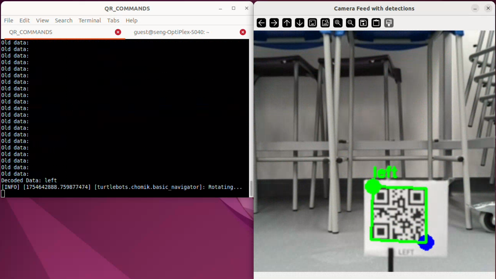
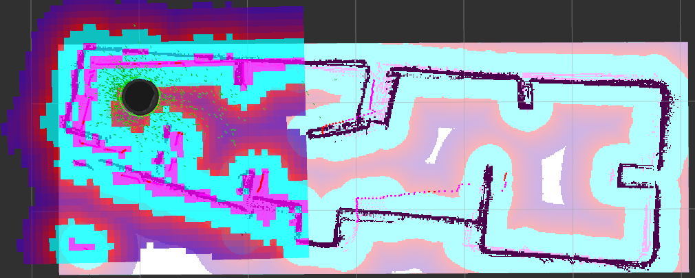

# turtlebot4-lab-tasks
Documentation of tasks constructed with turtlebot4 robots. For basic information and instructions on installing ROS and Turtlebot4 packages refer to [Turtlebot4 User Manual](https://turtlebot.github.io/turtlebot4-user-manual/). You might find solutions of some problems not covered here on [Turtlebot github page](https://github.com/turtlebot/turtlebot4/issues).

**Table of contents:** <br>
- [ ] [**SETTING UP**](#setting-up) <br>
- [ ] [Robot parameters](#robot-parameters) <br>
- [ ] [Common issues (FAQ)](#common-issues-faq)<br>
- [ ] [Reinstalling OS](#reinstalling-os)<br>
- [ ] [Time synchronization](#time-synchronization)<br>
- [ ] [**BASIC USE CASES**](#basic-use-cases)<br>
- [ ] [Teleoperation](#teleoperation)<br>
- [ ] [BT Gamepad](#bt-gamepad)<br>
- [ ] [**my_tb_nodes PACKAGE**](#my_tb_nodes-package)<br>
- [ ] [Starting out](#starting-out)<br>
- [ ] [**CAMERA USE CASES**](#camera-use-cases)<br>
- [ ] [Camera in RViz](#camera-in-rviz)<br>
- [ ] [Color tracking](#color-tracking)<br>
- [ ] [QR code commands](#qr-code-commands)<br>
- [ ] [**SLAM**](#slam)<br>
- [ ] [Generating a map](#generating-a-map)<br>
- [ ] [Navigation](#navigation)<br>
- [ ] [Turtlebot4 Navigator](#turtlebot4-navigator)<br>
- [ ] [*Autonomous navigation between points*](#autonomous-navigation-between-points)<br>
- [ ] [Cooperating turtlebots PoC](#cooperating-turtlebots-proof-of-concept)
 


## SETTING UP
The four robots are configured to use [Discovery Server](https://turtlebot.github.io/turtlebot4-user-manual/setup/discovery_server.html), meaning that the Raspberry Pi onboard connects to network and communication with Create3 board is done via USB cable.
- Before powering the robot up by placing it on the dock, make sure the network is already up and running. If the robot tries to connect before the network is ready, it will fail and you will need to restart it.
- **Lightring** indicates what is the robot doing. during the startup the LEDs spin. Do not make the robot do anything before it is ready (light stops spinning and it chimes) it *might* break it and reboot might be needed.
- On startup the lightring *will* turn yellow - indicating an error while connecting to Create3, however after 30 seconds the connection estabilished. Just wait for a bit.
- The robot is ready once the lightring is white and all 5 control LEDs are green.
- You can connect to the robot via SSH with username 'ubuntu' and password 'turtlebot4', this is the same for all of the robots. The IP adress is displayed on the screen onboard.

### Robot parameters
| Namespace | Discovery server ID | IP adress | Create3 frmw ver. | Working time sync | OS |
| - | - | - | - | - | - |
| /bob | 2 | 192.168.0.220 | H.2.6 | NO | tutel |
| /bobek | 3 | 192.168.0.20 | H.2.6 | NO | tutel |
| /turtlebots/tutel | 1 | 192.168.0.134 | H.2.6 | YES | tutel |
| /turtlebots/chomik | 0 | 192.168.0.23 | H.2.6 | YES | tutel |
---

**Notes**

- The networks SSID is 'HR_department' and the password is 'tutelROBOT3'
- OS "tutel" refers to a particular version and configuration that prooved to work. The file is too big to be uploaded, hence is stored elsewere. More info in [Reinstalling OS](#reinstalling-os)
- Robots are using Discovery Server configuration, to reduce network traffic ([info here](https://turtlebot.github.io/turtlebot4-user-manual/setup/networking.html#simple-discovery)), to see ROS topics of the robots user PC must be configured with the right IP adresses and server IDs ([see here](https://turtlebot.github.io/turtlebot4-user-manual/setup/discovery_server.html#user-pc))

### Common issues (FAQ)
**ROS topics not visible**
Possible causes/solutions:
- Run ```ros2 topic list``` again, sometimes after startup the topics won't show immidiately.
- Check if the robot is connected to the network, when idle for a long time, the robot can disconnect, even though the OLED display is still showing the IP adress. Best way to check is to ``ping`` the robots IP. If the robot disconnected, it is unlikely it will reconnect, you need to reboot it.
- Check if the "COMM" LED onboard is green, sometimes the Create3 randomly disconnects and stops publishing to topics. Reboot the robot.
- The user PC might be configured wrong, try redoing the setup [see here](https://turtlebot.github.io/turtlebot4-user-manual/setup/discovery_server.html#user-pc) and make sure to enter correct values.

**How to stop the lidar?**
Call service:

```shell
ros2 service call /<namespace>/stop_motor std_srvs/srv/Empty {}
```

**Battery % showing 0?** Battery status is recieved from Create3, if it shows 0, Create3 isn't connected propperly. Reboot the robot.

**Lightring flashing red** Battery level is below 20 %.

**What network are robots connected to?** The networks SSID is 'HR_department' and the password is 'tutelROBOT3'.

**Why aren't camera topics visible?** When the robot is docked, the camera stops working to "save power". Undock the  robot and after a while, the topics should show up.

**Commands from OLED display not working?** Choosing a command (Docking, etc.) from the display calls an action managed by Create3. If nothing happens, the Create3 is likely not connected and requires rebooting the robot.


### Reinstalling OS
Download the image of the OS (the one that worked for us, no guarantees for versions from the turtlebot web). Use the [RasPi imager](https://www.raspberrypi.com/software/) to write to the SD card. Do not customize any parameters. On startup the robot *will not* be in the accesspoint mode, it will try to connect to a netework with SSID "HR_department" It will also have its namespace set to */tutel*, it will be configured as Discovery Server and The discovery Server ID will be 1. Those parameters need to be changed accordingly. I Recommend not having any other turtlebots active when first starting the reinstalled one. The creditals for ssh are the same, username: ubuntu, password: turtlebot4. You may also need to set up time synchronization, refer to [Time synchrronization](#time-synchronization).
<br><mark>Important:</mark> Uniqe namespace **has** to be set for every robot. When left empty, the Create3 will fail to communicate.

### Time synchronization
For creating a map, navigating and localization to work, the Turtlebot's time has to be synchronized with the user PC. Since the robots are connecting to network with no internet access, the time must be synced with the user PC directly. The Raspberry Pi gets the time from user PC and passes it down to Create3. files [example_chrony_raspi](config/example_chrony_raspi.conf) and [example_chrony_user_pc](config/example_config_user_pc.config) show how the chrony configuration should look. In general, you can follow [this guide](https://iroboteducation.github.io/create3_docs/setup/compute-ntp/#step-by-step).

You can check the time of the robot via ssh using the command ```date```
The directory where *chrony.conf* can be found is ```sudo nano /etc/chrony/chrony.conf```

---
**Note:** Workaround to this process is to connect the robot to the internet temporarly. This can be done using ethernet connection or by creating a temporary hotspot with the same credentials as the original network. (After turning the original network off).


## BASIC USE CASES
### Teleoperation
For driving the robot using keyboard run:
```shell
ros2 run teleop_twist_keyboard teleop_twist_keyboard --ros-args -r /cmd_vel:=/<namespace>/cmd_vel
```
This node publishes Twist messages to the specified topic, allowing it to drive around.
Make sure to use the right namespace for the robot.
### BT Gamepad
TODO

## my_tb_nodes PACKAGE
Provided is a ros2 package that uses python as its main language. This package contains demo scripts for various use cases described in detail below. It builds on top of [nav2_simple_commander](https://github.com/ros-navigation/navigation2/tree/galactic/nav2_simple_commander) package from the Nav2 stack and [turtlebot-navigation](https://github.com/turtlebot/turtlebot4/tree/galactic/turtlebot4_navigation) package. Some of the use cases are taken from [turtlebot4_python_tutorials](https://github.com/turtlebot/turtlebot4_tutorials/tree/jazzy/turtlebot4_python_tutorials) package.

The turtlebot documentation only describes usage of those packages inside of a simulated enviroment. Due to problems with building the packages to use with real robots, instead of using entire packages we resorted to using only the files necessary for the demos to work. In particular, it is the [robot_navigator](https://github.com/ros-navigation/navigation2/blob/humble/nav2_simple_commander/nav2_simple_commander/robot_navigator.py) class from nav2_simple_commander, used under the name [my_robot_navigator.py](src/my_tb_nodes/my_tb_nodes/my_robot_navigator.py) and the [turtlebot4_navigator](https://github.com/turtlebot/turtlebot4/blob/galactic/turtlebot4_navigation/turtlebot4_navigation/turtlebot4_navigator.py) class of turtlebot_navigation, now called [my_turtlebot4_navigator.py](src/my_tb_nodes/my_tb_nodes/my_turtlebot4_navigator.py).

Class **my_robot_navigator** implements methods to interact with Nav2 stack, such as navigating to position, planning path through wapoints or setting initial pose.
Class **my_turtlebot4_navigator** implements features specific for turtlebot such as docking. 
On top of that I added functions to make use of actions available on turtlebot by default, so they can be called directly from a python script. Those are functions are:
| name | arguments |
| - | - |
| drive_distance(distance) | distance to drive in meters |
| rotate_angle_deg(angle) | angle to rotate in degrees, negative number means clockwise |
| rotate_angle(angle) | angle to rotate in radians, negative number means clockwise |
| drive_arc(angle, radius) | partion of circle to drive in radians, radius of the arc |


### Starting out
To use the package, clone this repo:
```shell
git clone https://github.com/kuceram2/turtlebot4-lab-tasks.git -b main
```
Run colcon build in the root directory and source the overlay:
```shell
cd ~/turtlebot4-lab-tasks
colcon build --symlink-install
source install/setup.bash
```
When installed, you can run the scripts as ros nodes using:
```shell
ros2 run my_tb_nodes <executable name> --ros-args -p <arguments>
```
Or as raw python script after changing to the directory of the file using:
```shell
python3 <file_name> <arguments>
```
**Note:** when running the files without ROS (raw), you need to change the way arguments are passed:

```python
# Use with ROS
self.declare_parameter('namespace', '')
namespace = self.get_parameter('namespace').get_parameter_value().string_value

# Else use this
namespace = sys.argv[1]
```
---
**Note:** When using the package, it is assumed that you have basic Turtlebot4 packages and Nav2 package installed.


## CAMERA USE CASES
Below are described demos using the camera. The topics with camera feed are only available when the robot is not docked.
### Camera in RViz
To view the camera feed in RViz, run:
```
ros2 launch turtlebot4_viz view_robot.launch.py namespace:=<namespace>
```
Add 'Camera' to the Displays tab and set the topic to image_raw.


### Color tracking
Script [colour_tracking_openCV.py](src/my_tb_nodes/my_tb_nodes/colour_tracking_openCV.py) is a demo of using the robot to follow object of certain colour. The robot spins around looking for anything orange and then follows it.
To run:
```
ros2 run my_tb_nodes colour_tracking --ros-args -p namespace:=<namespace>
```
This command creates a ros node, that shows the camera feed with detected color blobs and commands the robot by publishing Twist messages to /cmd_vel topic.

**How it works:**
The class OrangeBlobDetector inherits from Node class. This means it can interact with ROS. Topic subscriber reads camera feed from topic, then openCV library is used to detect blobs of specified color. Then based on the position of the blob within the frame, message is published to the /cmd_vel topic.


**Demo video:** https://github.com/kuceram2/turtlebot4-lab-tasks/blob/main/resource/colour_tracking/color_tracking_vid.mp4


### QR code commands
Script [qr_commands.py](src/my_tb_nodes/my_tb_nodes/qr_commands.py) drives the robot based on commands decoded from qr codes detected by the camera. In the demo the robot only reacts to four commands: start, left, right, stop. This allows the user to build a simple route for the robot to follow.
The robot waits until a qr code with the command 'forward' is detected and then follows next commands.

**Resources**
* PDF with qr codes: [QR codes.pdf](resource/qr_code_detection/qr_codes.pdf)
* 3D printable stand for qr code cards: [base.stl](resource/qr_code_detection/qr_code_base.stl), [stand.stl](resource/qr_code_detection/qr_code_stand.stl)

**Demo video:** [video](https://github.com/kuceram2/turtlebot4-lab-tasks/blob/main/resource/qr_code_detection/qr_commands_driving.mp4)

## SLAM
Turtlebot can create maps of its surroundings and use them for localization later.
### Generating a map
To generate a map, follow the [tutorial](https://turtlebot.github.io/turtlebot4-user-manual/tutorials/generate_map.html#generating-a-map) in Turtlebot User manual.
In every command, namespace has to be specified. To launch slam, run:
```shell
ros2 launch turtlebot4_navigation slam.launch.py namespace:=<namespace>
```
Optionally, you can run slam with modified parameters. [This](config/my_slam_params.yaml) is example configuration yaml file. It increases the resolution of the map, enabling more accurate navigation. You can also try and tune it yourself.
To run slam with custom params file:
```shell
cd ~/turtlebot4-lab-tasks
ros2 launch turtlebot4_navigation slam.launch.py params:=config/my_slam_params.yaml namespace:=<namespace>
```
To save the map, run:
```shell
ros2 run nav2_map_server map_saver_cli -f "map_name" --ros-args -p map_subscribe_transient_local:=true -r __ns:=<namespace>
```
The map will be saved to the directory, where you ran the command.

If your robot is operating in relatively tight spaces, I recommend using a higher resolution map. With low resolution map, some parts of the arena can become inaccessable due to the created costmap being low res and therefore blocking too much space. Bellow is a comparison of two maps of simmilar arena with different resolutions, first one has resolution of  0.05 m, second one 0.01 m.



### Navigation
---
<mark> Important: </mark>
For some reason, launching RViz, localization and navigation is only succesful **once after startup** if you end the process, to get it to run again you will *probably* have to restart the robot.

---
For launching navigation, follow the [tutorial](https://turtlebot.github.io/turtlebot4-user-manual/tutorials/navigation.html) in User Manual. **Don't forget to add 'namespace' argument when launching nodes.**

When viewing coordinates of the published points, remember to use the namespace, e.g.
```
ros2 topic echo <namespace>/clicked_point
```
When the robot is navigating to position, you can also take over the driving using teleoperation. After you stop sending commands, the robot will continue navigating. This is useful, if the robot gets 'stuck'. Simply give it a hint where to go using the teleoperation.

While navigating, you can also view the camera feed to get better idea of what the robot is doing. For that refer to [Camera in RViz](#camera-in-rviz)

**Demo video:** [video](https://github.com/kuceram2/turtlebot4-lab-tasks/blob/main/resource/slam/navigating_camera_feed.webm)

### Turtlebot4 Navigator
Below are described some examples that we implemented with real robots. Same Examples are used in [Turtlebot4 Navigator](https://turtlebot.github.io/turtlebot4-user-manual/tutorials/turtlebot4_navigator.html) tutorial in the User Manual, but that examples are meant to be run in simulated enviroment using Turtlebot4 simulator.

#### Navigate through poses
TODO

#### Mail delivery
TODO

### Cooperating Turtlebots (proof of concept)
In  this part I tried to get the robots to "see" each other, in order to be able to cooperate, distribute tasks efectively and allow multiple robots to operate in the same enviroment without risk of coliding. Despite wide range of possible applicatons,I haven't found any information about people working on similar projects.

##### Limitation description
 The robots are using lidars to map their surroundings, and as the lidars of all the robots are at the same level, it is impossible for one robot to reliably detect others.

 Image below shows robot with data from its lidar (red dots).

next photo shows actual position of two robots at the same moment. It is clear that detecting other turtlebots cannot be done by using lidar alone.


In the user guide there is a tutorial on [Multiple robots](https://turtlebot.github.io/turtlebot4-user-manual/tutorials/multiple_robots.html) but it only focuses on using multiple robots independently at the same time, this is achieved by using namespaces for the robots.

#### More robots in RViz
When launching RViz, namespace needs to be specified, so RViz can only take relevant topics into account. To vizualize robots position and movement, it subscribes to /tf and /tf_static topics, where transforms are being published.
Each robot has its own topic with its own transforms. To visualize more robots at once we need their transfroms to be published on one topic and to be connected to a single tree.
Transforms form a tree structure allowing transform between any two frames to be calculated. Example of how the tree for one robot should look is [here](resource/multiple_robots/example_frames_tree.pdf).


The picture above shows how the frames tree of turtlebot should look like. **If The 'odom' frame is missing** in your tree, it is usualy because the Create3 is not connected, hence not publishing odometry transform calculated using wheel encoders. 

---
 **Note:** To generate a tree of your setup run:
```
ros2 run tf2_tools view_frames --ros-args \
    -r /tf:=/<namespace>/tf \
    -r /tf_static:=/<namespace>/tf_static
```
 PDF file will be created in the directory of the command.
 
 [This](https://www.youtube.com/watch?v=QyvHhY4Y_Y8) is a great vieo explaining frames and transforms.

 ---

If we want to combine trees of two robots into one, first we need a way to differenciate between transforms of individual robots, as the structure and naming is exactly the same for all of them. ROS1 had a feature called 'tf_prefix' that was dropped when migrating to ROS2 (as described in [This thread](https://github.com/ros/robot_state_publisher/issues/125)). It was esentially namespaces for frames.

##### Solution description

To overcome this limitation I wrote a node that takes transforms of two individual robots from their respective topics, adds apropriate 'tf_prefixes' and publishes them to a single topic where RViz can access them. Same thing is done with both static and dynamic transforms.
After the trees have uniqe prefixes assigned and can be told apart, aditional static transform is published between odometry frames of both robots to connect them to a single tree.

<mark>Important:</mark> As this is in state of development, it cannot be yet used in any configuration. Two robots must be used, with namespaces 'turtlebots/tutel' and 'trutlebots/chomik', otherwise changes to the code are required.

<mark >Important:</mark> Because the transform between odom frames is static and 'hard coded', it is necesary to position the robots accordingly. The transform sets the initial pose of the robots to this: **chomik is 0.5 m to the right from tutel.**

After sourcing your workspace, you can run the tf_prefix_publisher:
```
ros2 run my_tb_nodes tf_prefix_publisher
```
This will create new topics */turtlebots/tf* and */turtlebots/tf_static* with transforms of both robots combined.

You can check that the frame trees are now connected by printing out the transform between odom frames of both robots:
```
ros2 run tf2_ros tf2_echo tutel/odom chomik/odom --ros-args  \
-r /tf:=/turtlebots/tf \
-r /tf_static:=/turtlebots/tf_static
```
Output should be this:
```shell
[INFO] [1755176353.609067885] [tf2_echo]: Waiting for transform tutel/odom ->  chomik/odom: Invalid frame ID "tutel/odom" passed to canTransform argument target_frame - frame does not exist
At time 0.0
- Translation: [0.000, -0.500, 0.000]
- Rotation: in Quaternion [0.000, 0.000, 0.000, 1.000]
- Rotation: in RPY (radian) [0.000, -0.000, 0.000]
- Rotation: in RPY (degree) [0.000, -0.000, 0.000]
- Matrix:
  1.000  0.000  0.000  0.000
  0.000  1.000  0.000 -0.500
  0.000  0.000  1.000  0.000
  0.000  0.000  0.000  1.000
  ...
```

Now you can launch RViz:
```
ros2 launch turtlebot4_viz view_robot.launch.py namespace:=turtlebots
```
Set 'fixed frame' to ``tutel/odom`` and frames shoul become visible.

Add another ``RobotModel`` component and fill in ``Description topic`` and ``TF prefix`` for both robots.

You should now see both robots. If you now drive one of the robots using teleoperation, their relative position will change.


**Demo video:** [video](https://github.com/kuceram2/turtlebot4-lab-tasks/blob/main/resource/multiple_robots/two_bots_moving.webm)

#### Lidar data from more robots in RViz
For the robots to be able to run localization and navigation, lidar data from both robots must be available. Robots publish lidar data on /scan topic, it is a array of values for each ray the lidar sends out. For the data to be interpreted right, it is bound to a frame of the robot called ``rplidar_link``.
The typical message looks like this:
```
header:
  stamp:
    sec: 1755181549
    nanosec: 591884338
  frame_id: rplidar_link
angle_min: -3.1241390705108643
angle_max: 3.1415927410125732
angle_increment: 0.005806980188935995
time_increment: 0.00011203992471564561
scan_time: 0.12089107930660248
range_min: 0.15000000596046448
range_max: 12.0
ranges:
- 2.4600000381469727
- 2.4600000381469727
- 2.4600000381469727
- 2.444000005722046
- 2.427999973297119
- 2.4079999923706055
- 2.3959999084472656
- 2.388000011444092
- 2.375999927520752
- 2.375999927520752
...
```
The problem is, that now that we added tf_prefixes, rviz no longer uses frame 'rplidar_link'. Instead, there are now two frames called 'tutel/rplidar_link' and 'chomik/rplidar_link'. 
Temporary workaroud is the script [scan_republisher.py](src/my_tb_nodes/my_tb_nodes/scan_republisher.py). 
It subscribes to the original 'scan' topics, modifies the 'frame_id' proprety of every recieved message by adding the prefix and publishes it to new topic called 'laser_scan'.

After launching the tf_republisher and seeing both robots in RViz, we can add the lidar data. Run:
```
ros2 run my_tb_nodes scan_republisher
```
Add another ``LaserScan`` object to Rviz to see data from both lidars. Then set the source topics. you should now see lidar readings of both robots.


By unchecking the 'Use rainbow' option from LaserScan menu, you can set the colour range of the readings by setting 'Min color' and 'Max color' parameters.

<mark >Important:</mark> Because the transform between odom frames is static and 'hard coded', for the lidar data to be alligned correctly it is necesary to position the robots accordingly. The transform sets the initial pose of the robots to this: **chomik is 0.5 m to the right from tutel.**

**Demo video:** [video](https://github.com/kuceram2/turtlebot4-lab-tasks/blob/main/resource/multiple_robots/two_bots_lidar_data.webm)


